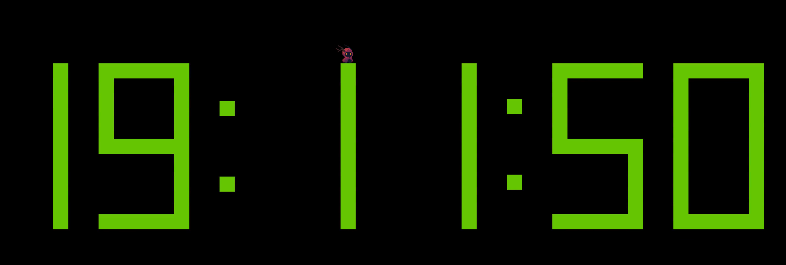
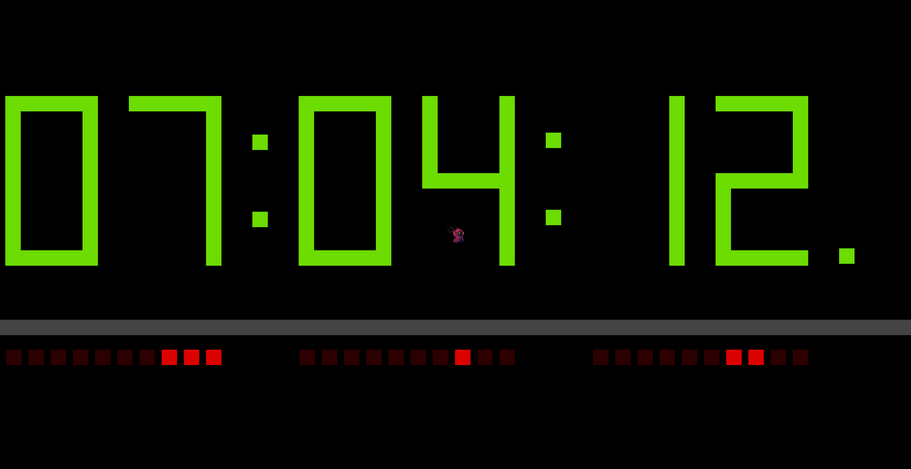

# Kaos Clock Demo

A playable real-time clock built in Godot 4. Jump around on a giant 7-segment display showing the current time down to the millisecond.

---
## Video (Click preview image below!)

[](https://youtu.be/34eMLo5-dD8)

---

## Screenshots



---



---

## How to Play

### Keyboard
- A -> Move Left
- D -> Move Right
- W -> Jump
- (Hold) Shift -> Sprint

### Xbox 360 Controller
- D Pad -> Left / Right Movement
- A -> Jump
- (Hold) X -> Sprint

---

## Built With

- Godot 4
- GDScript

---

## How to Run

**Option A — Just play it:**
Download the latest export from the [Releases](https://github.com/kaoticengineering/kaos-clock-demo/releases) page and run the executable. No Godot installation required.

**Option B — Open in Godot:**
1. Clone the repo
   ```bash
   git clone https://github.com/kaoticengineering/kaos-clock-demo.git
   ```
2. Open Godot 4 and import the project
3. Hit Play

---

## How It Works

The clock is a physical environment made entirely of `StaticBody2D` blocks. Each digit is a 7-segment display built from individual block instances grouped into segments A through G — matching standard 7-segment naming convention (A = top, clockwise to F, G = center).

`clock.gd` reads the system time 10 times per second using Godot's `Time.get_time_dict_from_system()` for hours, minutes, and seconds, and `Time.get_ticks_msec()` for the millisecond portion. Each two-digit value is split into individual digits and passed to the corresponding `Digit` node via a `display(value)` call.

`digit.gd` maintains a lookup table mapping 0–9 to which segments should be active. On each `display()` call it iterates through all 7 segments, toggling both `visible` and the collision layer/mask on each block accordingly — active segments are solid and collidable, inactive segments are invisible and passthrough.

The player is a `CharacterBody2D` with infinite jumps, meaning you can hop freely between any segment at any time.

---

## Credits

- **Character Sprite** — [Lucky Loops](https://lucky-loops.itch.io/character-satyr)
- **Background Music** — [Minaverus](https://www.youtube.com/channel/UCPAPwTW44Cl3e28gucMZ7RQ)

## Roadmap / Future Modifications

- [x] Sound effects for block state changes and player landing / jumping
- [ ] Reset mechanic (Esc key / controller button)
- [ ] Camera scaling for different screen sizes
- [x] Binary clock display
- [ ] Expand into a full platformer? Would someone play this?
- [ ] Swap out Character Sprites to something more in-theme?
- [ ] Add decorations (flowers, sky decor like a moon, etc)